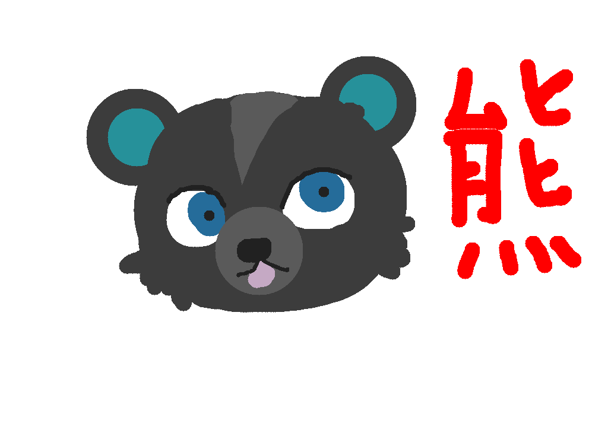

# Paint
> *Like Paint, but with less features*

 

## Features
- Two brushes: square and round
- Color picker to reuse a color from the canvas
- Undo / Redo 

## Installation
Download all files and build with CMake. 

## External libraries
- OpenGL3 and GLFW for rendering
- [ImGui](https://github.com/ocornut/imgui) for the user interface
- [stb_image_write](https://github.com/nothings/stb/blob/master/stb_image_write.h) for saving the result to file